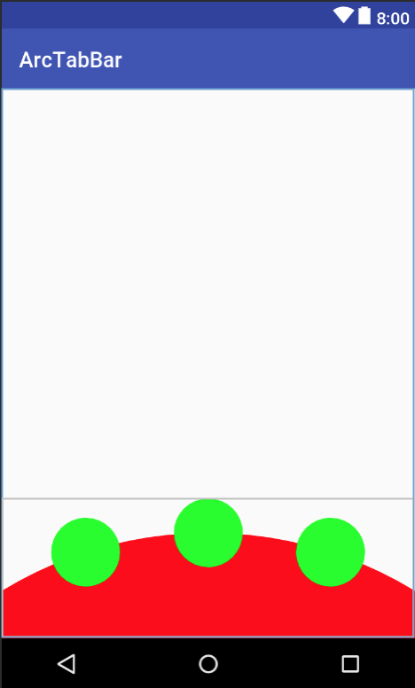

# ArcTabBar

## Usage :chart_with_upwards_trend:
- Just import all class in folder /arctabbar/src/main/java/com/haytran/arctabbar/ to your project and play.

## Questions & Issues :thinking:
This repository's issue tracker is only for bugs and feature requests. The maintainers ask that you refrain from asking questions about how to use ArcTabBar through the issue tracker.

 

# License :page_facing_up:

Copyright 2018 Hay Tran

Licensed under the Apache License, Version 2.0 (the "License");
you may not use this file except in compliance with the License.
You may obtain a copy of the License at

    http://www.apache.org/licenses/LICENSE-2.0

Unless required by applicable law or agreed to in writing, software
distributed under the License is distributed on an "AS IS" BASIS,
WITHOUT WARRANTIES OR CONDITIONS OF ANY KIND, either express or implied.
See the License for the specific language governing permissions and
limitations under the License.

 
